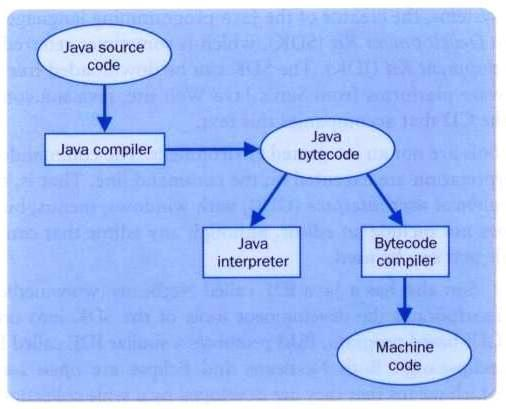
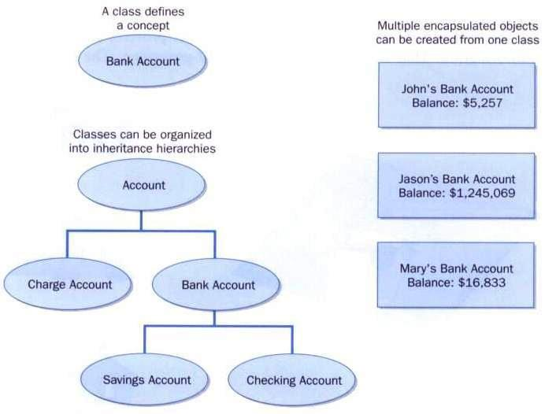

# **Java Foundations (Second Edition)**
## John Lewis, Peter DePasquale & Joseph Chase

[Back to TOC](./THE BOOK ON JAVA.md)

# CHAPTER 1 INTRODUCTION

##KEYWORDS##

| [hardware](#01) | [software](#02) | [program](#03) | [applications](#04) | [program statements](#05) 
| [classes](#06) | [methods](#07) | [statements](#08) | [class header](#09) | [class body](#10) 
| [method header](#11) | [method body](#12) | [comments](#13) | [identifiers](#14) | [case sensitive](#15) 
| [title case](#16) | [upper case](#17) | [reserved words](#18) | [white space](#19) | [machine language](#20) 	
| [source code](#21) | [bytecode](#22) | [interpreter](#23) | [architecture-neutral](#24) | [development environment](#25) 
| [integrated development environment](#26) | [debugger](#27) | [syntax](#28) | [semantics](#29) | [compile-time errors](#30) 
| [run-time errors](#31) | [logical errors](#32) | [object-oriented approach](#33) | [development activities](#34) | [Software requirements](#35) 
| [functional specification](#36) | [software design](#37) | [implementation](#38) | [testing](#39) | [object-oriented](#40) 
| [object](#41) | [state](#42) | [behaviours](#43) | [class](#44) | [inheritance](#45) 
| [encapsulated](#46) 

    


Abraham Lincoln:

> Whatever you are, be a good one.

## INTRODUCE THE JAVA PROGRAMMING LANGUAGE ##

**What is a computer?**<br>
A computer is composed of <a id="01">_hardware_</a> and <a id="02">_software_</a>. The hardware is some physical and 
tangible pieces that support computing power. The software consists of programs and the 
data those programs use. A <a id="03">_program_</a> is a series of instructions that the hardware executes
one after the other. Programs are sometimes called <a id="04">_applications_</a>.

**What is a programming language?**<br>
A programming language specifies the words and symbols that we can use to write a program.
A programming language employs a set of rules that dictate how the words and symbols can be
put together to form valid <a id="05">_program statements_</a>. 

**The Java programming language**<br>
The Java programming language was created by Sun Microsystems, Inc. It was introduced in 1995 
and its popularity grew quickly.

A Java program is made up of one or more <a id="06">_classes_</a>. Each class contains one or more
 <a id="07">_methods_</a>. A method contains program <a id="08">_statements_</a>.

A Java application always contains a method called `main`.

Shown below is the basic structure a Java program:

```java
//********************************************************************
// Lincoln.java Java Foundations
//
// Demonstrates the basic structure of a Java application.
//********************************************************************
public class Lincoln {
	//-----------------------------------------------------------------
	// Prints a presidential quote.
	//-----------------------------------------------------------------
	public static void main(String[] args) {
		System.out.println("A quote by Abraham Lincoln:");
		System.out.println("Whatever you are, be a good one.");
	}
}
```
A typical Java program like `Lincoln.java` above has a class and a method(the `main` method). 
Each class has a <a id="09">_class header_</a> and a <a id="10">_class body_</a>. By the same token, each method
consists of a <a id="11">_method header_</a> and a <a id="12">_method body_</a>. 

You can add <a id="13">_comments_</a> almost anywhere in the program. Comments should be added to explain 
the purpose of the program and describe processing detail. They do not affect how a program
works. Java comments come in three forms:

```java
// this comment runs to the end of the line
/* this comment runs to the terminating
   symbol, even across line breaks */
/** this is a javadoc comment */
```

**Identifiers**<br>

* The words a programmer uses in a program are called <a id="14">_identifiers_</a>
* An identifier can be made up of letters, digits, the underscore character (\_)
and the dollar sign
* An identifier cannot begin with a digit
* Java is <a id="15">_case sensitive_</a>. So `Total`, `total` and `TOTAL` are three different identifiers
* By convention, programmers take advantage of different case styles for different types of
identifiers, e.g. 
  * <a id="16">_title case_</a> for class names - `Lincoln`
  * <a id="17">_upper case_</a> for constants - `MAXIMUM`
* Sometimes we choose identifiers ourselves when writing a program (such as
`Lincoln`). Sometimes when we use another programmer's code, we need to use
the identifiers that he or she chose (such as `println`). Often we use special
identifiers called <a id="18">_reserved words_</a> that already have a predefined meaning in
the programming language. A reserved word cannot be used in any other way.

**Java reserved words:**

 A - C       | D - F       | G - N       | P -  S      | T - W 
-------------|-------------|-------------|-------------|-------------
abstract     | default     | goto*       | package     | this
assert       | do          | if          | private     | throw 
boolean      | double      | implements  | protected   | throws
break        | else        | import      | public      | transient 
byte         | enum        | instanceof  | return      | true 
case         | extends     | int         | short       | try
catch        | false       | interface   | static      | void 
char         | final       | long        | strictfp    | volatile 
class        | finally     | native      | super       | while
const*       | float       | new         | switch      | 
continue     | for         | null        | synchronized|

**White space**<br>

* Spaces, blank lines, and tabs are called <a id="19">_white space_</a>
* White space is used to separate words and symbols in a program
* Extra white space is ignored

**Program formatting**<br>
A valid Java program can be formatted many ways. At any rate, programs should
be formatted to enhance readability (e.g. using consistent indentation).

## PROGRAM COMPILATION AND EXECUTION ##

**Basic programming steps**<br>
A program is written in an editor, compiled into an executable form, and then executed.
If errors occur during compilation, an executable form is not created.

**What is the mechanics of developing a program?**<br>
This involves several activities:

  * writing the program in a specific programming language (such as Java)
  * translating the program into a form executable by the computer
  * investigating and fixing various types of errors that can occur

Software tools can be used to help with all parts of this process.

**Language levels**<br>
There are four programming language levels:

* machine language (e.g. for x86 processors)
* assembly language (e.g. for x86 processors)
* high-level language (e.g. Java)
* fourth-generation language (e.g. SQL)

Each type of CPU has its own specific <a id="20">_machine language_</a>. The other levels were created 
to make it easier for a human being to read and write programs

A high-level expression and its lower level equivalents


**Compilation and Java's approach**<br>
A compiler is a software tool which translates <a id="21">_source code_</a> into a specific target
language. Often, that target language is the machine language for a particular CPU 
type. However, Java compiler is somewhat different.

The Java compiler translates Java source code into <a id="22">_bytecode_</a>. Java bytecode is not the
machine language for any traditional CPU. Another software tool, called <a id="23">_interpreter_</a>,
translates bytecode into machine language and executes it. Therefore the Java compiler is
not tied to any particular machine/CPU. Java is considered to be <a id="24">_architecture-neutral_</a>.



**Environments for program development**<br>
A <a id="25">_development environment_</a> is the set of tools used to create, test, and modify a 
program. And an <a id="26">_integrated development environment_</a> (IDE) combine these tools into
one software program. All Java IDEs contain key tools such as a compiler and interpreter.
Some include additional tools such as a <a id="27">_debugger_</a>, which helps a programmer to find 
errors.

There are many IDEs that support the development of Java software, including:

* Eclipse
* NetBeans
* BlueJ
* jGRASP
  
Though the details of these IDEs differ, the basic compilation and execution process is
essentially the same.

**Syntax and semantics of a program**<br>
The <a id="28">_syntax_</a> defines how identifiers, reserved words, and symbols can be 
put together to make a valid program. The <a id="29">_semantics_</a> of a program statement defines 
what that statement means (i.e. its purpose or role in a program). A program that is
syntactically correct is not necessarily semantically/logically correct. A program will
always do what we tell it to do, not what we `meant` to tell it to do.

**Errors that can occur in a program**<br>
There are three types of errors:

* <a id="30">_compile-time errors_</a> - The compiler will find syntax errors and other basic problems
* <a id="31">_run-time errors_</a> - During program execution, a problem such as trying to divide by zero
will cause a program to terminate abnormally
* <a id="32">_logical errors_</a> - A program may run, but produce incorrect results as a result of, 
perhaps, an incorrect formula.

## PROBLEM SOLVING IN GENERAL ##

**Problem solving process**<br>
The purpose of writing a program is to solve a problem.
 
Solving a problem consists of several activities:

- understand the problem
- design a solution
- consider alternatives and refine the solution
- implement the solution
- test the solution

These activities are not linear – they may overlap and interact.

**How to design a solution**<br>
The key to designing a solution is breaking it down into manageable pieces. Such separate
pieces are responsible for certain parts of the solution. An <a id="33">_object-oriented approach_</a>
is suitable for this kind of solution decomposition. Under this approach, our solutions are
dissected into pieces called objects and classes.

## THE SOFTWARE DEVELOPMENT PROCESS ##

**Basic development activities**<br>
Any proper software development effort consists of four basic <a id="34">_development activities_</a>:

- establishing the requirements for solving a problem
- creating a design
- implement the design
- testing the implementation

These steps are not linear and may often overlap and interact

* <a id="35">_Software requirements_</a> specify what a program must accomplish
* <a id="36">_Functional specification_</a> documents the expression of these requirements
* A <a id="37">_software design_</a> indicates how a program will accomplish its requirements
* <a id="38">_Implementation_</a> is the process of writing the source code that will solve the problem
* <a id="39">_Testing_</a> is the act of ensuring that a program will work as intended given all the
constraints under which it must perform 

## OVERVIEW OF OBJECT-ORIENTED PRINCIPLES ##

**Object-oriented programming**<br>
Java is an <a id="40">_object-oriented</a> programming language. An object is a fundamental entity
in a Java program. Objects can be used effectively to represent real-world entities.
For instance, an object might represent a particular employee in a company. Each
employee object handles the processing and data management related to that employee.

**Objects**<br>
An <a id="41">_object_</a> has <a id="42">_state_</a> (descriptive characteristics) and <a id="43">_behaviours_</a> (what it can do).
For instance, the state of a bank account includes its account number and its current
balance; the behaviours associated with a bank account include the ability to make
deposits and withdrawals. Note that the behaviour of an object might change its state.

**Classes**<br>
An object is defined by a <a id="44">_class_</a>, i.e. a class is the blueprint of an object. The class
uses methods to define the behaviours of the object. The class that contains the main
method of a Java program represents the entire program. 

**Classes and objects**<br>
A class represents a concept, and an object represents the embodiment of that concept.
Multiple objects can be created from the same class.

A class is like a blueprint of, say, a house from which you can create many of the "same"
house with different characteristics.

One class can be used to derive another class via/from <a id="45">_inheritance_</a>, such that classes
can be organized into hierachies.

An object is <a id="46">_encapsulated_</a>, protecting the data it manages.




