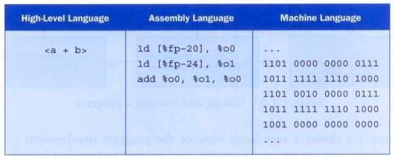

# **Java Foundations (Second Edition)**
## John Lewis, Peter DePasquale & Joseph Chase

[Back to TOC](./THE BOOK ON JAVA.md)

# CHAPTER 1 INTRODUCTION

Abraham Lincoln:

> Whatever you are, be a good one.

**What is a computer?**<br>
A computer is composed of *hardware* and *software*. The hardware is some physical and 
tangible pieces that support computing power. The software consists of programs and the 
data those programs use. A *program* is a series of instructions that the hardware executes
one after the other. Programs are sometimes called *applications*.

**What is a programming language?**<br>
A programming language specifies the words and symbols that we can use to write a program.
A programming language employs a set of rules that dictate how the words and symbols can be
put together to form valid *program statements*. 

**The Java programming language**<br>
The Java programming language was created by Sun Microsystems, Inc. It was introduced in 1995 
and its popularity grew quickly.

A Java program is made up of one or more *classes*. Each class contains one or more *methods*.
A method contains program *statements*.

A Java application always contains a method called `main`.

Shown below is the basic structure a Java program:

```java
//********************************************************************
// Lincoln.java Java Foundations
//
// Demonstrates the basic structure of a Java application.
//********************************************************************
public class Lincoln {
	//-----------------------------------------------------------------
	// Prints a presidential quote.
	//-----------------------------------------------------------------
	public static void main(String[] args) {
		System.out.println("A quote by Abraham Lincoln:");
		System.out.println("Whatever you are, be a good one.");
	}
}
```
A typical Java program like `Lincoln.java` above has a class and a method(the `main` method). 
Each class has a *class header* and a *class body*. By the same token, each method
consists of a *method header* and a *method body*. 

You can add *comments* almost anywhere in the program. Comments should be added to explain 
the purpose of the program and describe processing detail. They do not affect how a program
works. Java comments come in three forms:

```java
// this comment runs to the end of the line
/* this comment runs to the terminating
   symbol, even across line breaks */
/** this is a javadoc comment */
```

**Identifiers**<br>

* The words a programmer uses in a program are called _identifiers_
* An identifier can be made up of letters, digits, the underscore character (\_)
and the dollar sign
* An identifier cannot begin with a digit
* Java is _case sensitive_. So `Total`, `total` and `TOTAL` are three different identifiers
* By convention, programmers take advantage of different case styles for different types of
identifiers, e.g. 
  * _title case_ for class names - `Lincoln`
  * _upper case_ for constants - `MAXIMUM`
* Sometimes we choose identifiers ourselves when writing a program (such as
`Lincoln`). Sometimes when we use another programmer's code, we need to use
the identifiers that he or she chose (such as `println`). Often we use special
identifiers called _reserved words_ that already have a predefined meaning in
the programming language. A reserved word cannot be used in any other way.

**Java reserved words:**

 A - C       | D - F       | G - N       | P -  S      | T - W 
-------------|-------------|-------------|-------------|-------------
abstract     | default     | goto*       | package     | this
assert       | do          | if          | private     | throw 
boolean      | double      | implements  | protected   | throws
break        | else        | import      | public      | transient 
byte         | enum        | instanceof  | return      | true 
case         | extends     | int         | short       | try
catch        | false       | interface   | static      | void 
char         | final       | long        | strictfp    | volatile 
class        | finally     | native      | super       | while
const*       | float       | new         | switch      | 
continue     | for         | null        | synchronized|

**White space**<br>

* Spaces, blank lines, and tabs are called _white space_
* White space is used to separate words and symbols in a program
* Extra white space is ignored

**Program formatting**<br>
A valid Java program can be formatted many ways. At any rate, programs should
be formatted to enhance readability (e.g. using consistent indentation).

**What is the mechanics of developing a program?**<br>
This involves several activities:

  * writing the program in a specific programming language (such as Java)
  * translating the program into a form executable by the computer
  * investigating and fixing various types of errors that can occur

Software tools can be used to help with all parts of this process.

**Language levels**<br>

* There are four programming language levels:
  * machine language (e.g. for x86 processors)
  * assembly language (e.g. for x86 processors)
  * high-level language (e.g. Java)
  * fourth-generation language (e.g. SQL)
* Each type of CPU has its own specific *machine language*
* The other levels were created to make it easier for a human being
to read and write programs

A high-level expression and its lower level equivalents
